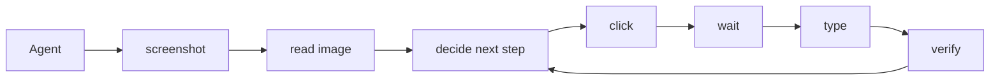
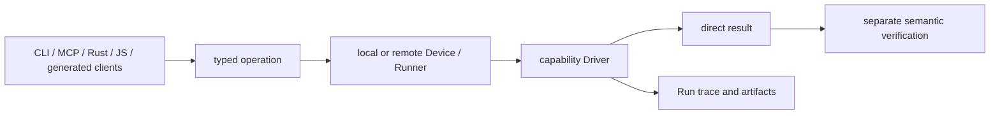

<p align="center">
  <picture>
    <source
      width="30%"
      srcset="./docs/assets/logo-short-height-dark.svg"
      media="(prefers-color-scheme: dark)"
    />
    <source
      width="30%"
      srcset="./docs/assets/logo-short-height-light.svg"
      media="(prefers-color-scheme: light), (prefers-color-scheme: no-preference)"
    />
    
  </picture>
</p>

<h1 align="center">AUV: Programmable Desktop Automation for AI Agents</h1>

[](LICENSE.md)

AUV (Application Use Via ...) is an open-source desktop automation runtime for
programmable computer use. It exposes typed operations through a CLI, Model
Context Protocol (MCP), Rust and JavaScript/TypeScript, with Run recording and
capture artifacts. Coding agents can use AUV to execute reusable application
workflows and inspect their results.

This repository is [0xSelenicDove/auv](https://github.com/0xSelenicDove/auv), a
fork of [moeru-ai/AUV](https://github.com/moeru-ai/auv). The fork retains upstream
AUV's architecture and maintains scroll-targeting fixes, agent-skill guidance
and reproducible optimization evidence. The [AUV Computer Control skill](.agents/skills/auv-computer-control/SKILL.md)
is maintained in this fork alongside the runtime.

[Why AUV?](#why-auv) ·
[Compare this fork with upstream](#this-fork-compared-with-upstream-auv) ·
[Build this fork](#quick-start-with-this-fork) ·
[Use the agent skill](#use-auv-with-codex-and-claude-code) ·
[Read performance evidence](#token-efficiency-and-speed-benchmarks) ·
[Browse documentation](docs/README.md)

<!-- START doctoc generated TOC please keep comment here to allow auto update -->
<!-- DON'T EDIT THIS SECTION, INSTEAD RE-RUN doctoc TO UPDATE -->
## Table of Contents

- [Why AUV?](#why-auv)
- [This fork compared with upstream AUV](#this-fork-compared-with-upstream-auv)
- [AUV vs native computer use vs browser automation](#auv-vs-native-computer-use-vs-browser-automation)
- [Desktop automation capabilities](#desktop-automation-capabilities)
- [Quick start with this fork](#quick-start-with-this-fork)
- [Use AUV with Codex and Claude Code](#use-auv-with-codex-and-claude-code)
- [Getting Started](#getting-started)
- [Understand AUV](#understand-auv)
- [Project origins](#project-origins)
- [Capability Matrix](#capability-matrix)
- [Token efficiency and speed benchmarks](#token-efficiency-and-speed-benchmarks)
- [Frequently asked questions](#frequently-asked-questions)
- [Development](#development)
- [Related](#related)
- [Acknowledgements](#acknowledgements)
- [Special Thanks](#special-thanks)
- [Star History](#star-history)
- [License](#license)

<!-- END doctoc generated TOC please keep comment here to allow auto update -->

## Why AUV?

Choose AUV when a desktop workflow needs reusable operations, explicit window
targeting and inspectable execution evidence. AUV lets an agent move repeated
UI work into typed commands or application code, then consume results and Run
artifacts. The agent still decides what to do and verifies whether the user's
requested outcome happened.

- **Reuse application workflows.** CLI, MCP and library frontends share typed
  operation and driver boundaries, so reusable behavior can live below the
  agent's prompts. See the [execution model](#understand-auv).
- **Inspect what happened.** Direct results, delivery metadata and recorded
  artifacts help explain an operation and support separate verification. See
  [Runs and artifacts](docs/TERMS_AND_CONCEPTS.md).
- **Use the capability the task needs.** Window capture, OCR and targeted input
  provide building blocks for native UI work. Availability depends on the
  command and platform; see [capabilities and evidence](#desktop-automation-capabilities).

These are architectural reasons to choose AUV, grounded in the linked source
and contracts. They are not a guarantee of lower token usage or faster task
completion. If an API, connector, accessibility interface or browser DOM already
covers the task, that existing surface may need fewer steps.

## This fork compared with upstream AUV

This fork keeps upstream AUV's core architecture and adds focused improvements
for agent-driven desktop work. The comparison below uses upstream
[commit `472fe84b` (v0.0.30)](https://github.com/moeru-ai/auv/tree/472fe84b89d2308e2c9cd444ef91cf3aac1c9789)
as its inspected baseline, reviewed on **2026-10-06**. It does not claim these
changes will remain exclusive to the fork as upstream evolves.

| Area | Upstream baseline | This fork's difference | Evidence level and limits |
| --- | --- | --- | --- |
| Core execution | Typed operations, drivers, CLI/MCP, SDKs and Run recording | Preserves these upstream foundations | [Source and contracts](docs/TERMS_AND_CONCEPTS.md); these are inherited capabilities |
| Scroll-search evidence | Observations include captures | Local invoke publishes the final observation as an artifact without another capture or OCR call; reports a stalled boundary as unconfirmed | [Hermetic regression tests](docs/ai/references/driver/2026-10-06-scroll-search-evidence.md); final Runner artifact publication remains separate |
| JSON output | Pretty-printed invoke JSON | Optional lossless `--compact-json` | [Renderer tests and fixture token counts](docs/ai/references/invoke-cli/2026-10-06-compact-json.md): 33.4–34.1% fewer response-text tokens in four fixtures, not whole-session savings |
| Command discovery | Expanded command help and window discovery | More compact help retaining guidance, plus app/title filters for window discovery | [Help contract tests and measurements](docs/ai/references/invoke-cli/2026-10-06-compact-help-benchmark.md), [window filtering regression tests](crates/auv-cli-invoke/src/commands/window_test.rs); filtering narrows results, not platform support |
| macOS foreground scrolling | Existing foreground delivery and focus handling | Prepares the exact target, checks foreground ordering and stamps the wheel event location | [Live receiver checks and regressions](docs/ai/references/driver/2026-10-06-scroll-focus-ordering.md), [event-location evidence](docs/ai/references/driver/2026-10-06-scroll-event-location.md); tested scenarios, not every app |
| Agent workflow guidance | Existing Runner and capture-reference infrastructure | Versioned skill favors known targets, existing connections, capture reuse and selected Runner reuse | [Skill](.agents/skills/auv-computer-control/SKILL.md), [reuse pilot and CLI lifecycle checks](docs/ai/references/driver/2026-10-06-runner-ocr-reuse.md); Runner reuse is upstream functionality |

The practical benefit is less redundant discovery and evidence collection,
smaller responses where explicitly selected, and more reliable delivery in the
reproduced macOS scroll cases. Choose this fork when those changes fit your
workflow and you can build from source. Choose upstream when its release and
packaging path fits your needs; the installers below distribute upstream builds.
The fork also requires maintaining and validating its changes across upstream
updates.

There is **no comprehensive fork-versus-upstream task benchmark**. The
[performance evidence](#token-efficiency-and-speed-benchmarks) compares specific
output formats, skill configurations or execution lifecycles. For example,
reusing an existing Runner was 32.82% faster than fresh sessions in one repeated
OCR pilot; that is not a 32.82% speedup over upstream AUV.

## AUV vs native computer use vs browser automation

Choose by the task's available interface rather than assuming one tool is
always fastest. This is a workflow-selection guide; the
[capability matrix](#capability-matrix) gives the existing project comparison.

| Approach | When to choose it | Cost or boundary to consider |
| --- | --- | --- |
| Application API or connector | The application already exposes the required data and action | Check that it covers the user's actual workflow and permissions |
| Native computer-use tools already in the agent host | Existing accessibility and input tools cover a short desktop task | Avoid adding AUV setup and skill discovery unless its capabilities are needed; the [earlier three-arm benchmark](docs/ai/references/driver/2026-10-06-three-arm-session-benchmark.md) measured extra tokens with AUV guidance |
| AUV | Native GUI work benefits from targeted capture/OCR, typed reusable operations or recorded Run evidence | Discovery, startup, skill context and verification still cost time and tokens; use the [task-specific evidence](#token-efficiency-and-speed-benchmarks) |
| Browser automation | The workflow is a web page with a usable DOM | Decide whether the task also needs native windows, OS dialogs or other desktop capabilities |

AUV can complement existing tools in the same workflow. Reuse an available
interface first, then add AUV where its operations or evidence provide a
concrete benefit.

## Desktop automation capabilities

AUV's repository interfaces cover the following responsibilities. These are
source-level descriptions; command and platform availability are narrower than
the existence of a driver. Use installed command help and the
[capability matrix](#capability-matrix) for limits, and linked evidence for
validated behavior.

| Need | AUV interface | Source and evidence |
| --- | --- | --- |
| Inspect a native application | Window discovery, targeted capture and OCR | [Window operations](crates/auv-cli-invoke/src/commands/window.rs) |
| Deliver input to a target | Typed keyboard, pointer and scroll operations with delivery metadata | [Input operations](crates/auv-cli-invoke/src/commands/input.rs), [macOS scroll-focus regression evidence](docs/ai/references/driver/2026-10-06-scroll-focus-ordering.md) |
| Keep execution inspectable | Direct operation results, Run records and screenshot artifacts | [Shared terms](docs/TERMS_AND_CONCEPTS.md), [tracing implementation](crates/auv-tracing/) |
| Reuse execution across calls | Daemon-owned Runners and routed capability clients | [Runner reuse pilot](docs/ai/references/driver/2026-10-06-runner-ocr-reuse.md), [TypeScript SDK](js/packages/sdk/README.md) |

Use AUV for native GUI automation, application testing and repeated workflows
that need its targeting or observation capabilities. When an application's API,
connector or native accessibility already supplies the needed data, use that
surface. For browser pages with a usable DOM, a browser automation tool is
usually the more direct path.

App and game integrations remain separate packages, including
[Apple Music](supported/apps/auv-apple-music/),
[macOS media control](crates/auv-media-macos/) and
[Balatro](supported/games/auv-game-balatro/). Their presence is not a claim that
all application workflows are implemented or tested.

## Quick start with this fork

The package-manager and release installers in [Getting Started](#getting-started)
install **upstream AUV releases**. To use this fork's source and changes, first
install the [Rust and platform build prerequisites](#install-with-cargo), then:

```sh
git clone --recurse-submodules https://github.com/0xSelenicDove/auv.git
cd auv
cargo build --release -p auv-cli --bin auv
./target/release/auv --version
./target/release/auv invoke window.capture --help
```

Source builds do not include the signed macOS Helper; see
[platform setup](#setup) and the installation notes before choosing a packaging
method. OS permissions must be granted on the machine being controlled.

For a macOS example, with TextEdit already open and the required permissions
granted, discover the matching window and capture it:

```sh
./target/release/auv invoke window.list --target app:com.apple.TextEdit --title Untitled --compact-json
./target/release/auv invoke window.capture --target app:com.apple.TextEdit --title Untitled --compact-json
```

Replace the app and title with your actual target. Inspect the screenshot at its
returned artifact `file_path`; an exit code alone does not verify the requested
application state. These commands demonstrate the current CLI contract, not a
new live application test. For OCR, inspect `window.findText --help` before use.

## Use AUV with Codex and Claude Code

The [versioned skill in this fork](.agents/skills/auv-computer-control/SKILL.md)
guides operation discovery, targeting, verification and reuse. Use this bundled
copy so the instructions match the fork. Install the entire
`.agents/skills/auv-computer-control` directory,
including its references, into your host's supported skill location. For Codex,
copy it to `~/.codex/skills/auv-computer-control`; for Claude Code, copy it to
`~/.claude/skills/auv-computer-control`.

Invoke `$auv-computer-control` in Codex or `/auv-computer-control` in Claude
Code. A skill supplies instructions; AUV supplies the execution runtime. The
host still needs shell access to the intended AUV binary or an already connected
MCP server. The linked benchmarks exercised Codex on macOS; they do not validate
Claude Code or every supported driver platform.

For repeated work, keep an existing MCP/SDK connection or reuse a selected
Runner through the CLI. Retain the exact Device and daemon endpoint; setting
`AUV_ENDPOINT` alone does not route an unqualified `invoke` through a Runner.
See the skill's [runner-reuse workflow](.agents/skills/auv-computer-control/references/operations.md#reuse-for-repeated-work).
A successful input call remains separate from verification of the user's goal.

## Getting Started

### Install

Install a prebuilt release:

#### macOS

```sh
brew install moeru-ai/tap/auv
auv --version
```

Alternatively, without [Homebrew](https://brew.sh/):

```sh
curl -fsSL https://raw.githubusercontent.com/moeru-ai/auv/main/install/install.sh | sh
```

#### Linux

```sh
curl -fsSL https://raw.githubusercontent.com/moeru-ai/auv/main/install/install.sh | sh
auv --version
```

> [!NOTE]
>
> Set `AUV_VERSION` or `AUV_INSTALL_DIR` to change the release version or the
> install directory (default: `~/.local/bin`).

#### Windows

##### Scoop

```powershell
scoop bucket add auv https://github.com/moeru-ai/auv
scoop install auv/auv
auv --version
```

##### Manual installation

Download the archive for your architecture:

- [x86-64](https://github.com/moeru-ai/auv/releases/latest/download/auv-x86_64-pc-windows-msvc.zip)
- [ARM64](https://github.com/moeru-ai/auv/releases/latest/download/auv-aarch64-pc-windows-msvc.zip)

Extract the archive to a permanent directory. Add that directory to your user
`PATH`. The archive contains a single `auv.exe`; the Windows helper is embedded.

### Install with proto

Install and configure [proto](https://moonrepo.dev/docs/proto) first. Then add
the AUV plugin and install the latest release:

```sh
proto plugin add auv "https://raw.githubusercontent.com/moeru-ai/auv/main/toolchain/proto/auv.toml" --to global
proto install auv latest --config-mode global --pin global
auv --version
```

> [!NOTE]
>
> `AUV Helper.app` for macOS is included in the `proto` installation. On
> Windows, `auv-helper.exe` is embedded in `auv.exe` and extracted only by the
> elevated helper setup command.

> [!WARNING]
>
> Linux musl is not supported. (But PRs are welcomed!)

### Install with Nix

Install [Nix](https://nixos.org/download/) 2.27 or later and enable the
`nix-command` and `flakes` experimental features. On macOS, install Apple's
build tools first:

```sh
xcode-select --install
```

Then install the default AUV package from this repository:

```sh
nix profile install 'git+https://github.com/moeru-ai/auv#default'
auv --version
```

The `git+https` transport is required so Nix fetches AUV's Git submodules. The
flake defines source-built packages for Apple Silicon and Intel macOS and for
x86-64 and ARM64 Linux. The package does not support Windows or Linux musl.

The Nix package does not embed the signed `AUV Helper.app`. On macOS, use
Homebrew, proto, or a direct release download if you need to run
`auv setup macos-helper install` with the official helper.

### Install with Cargo

Prerequisites: [Rust](https://www.rust-lang.org/tools/install) and the platform
build tools below. AUV includes the Protobuf sources, so Buf is not required.

> [!WARNING]
> `cargo install` does not include AUV Helper. Use an install method above if
> you need it.

#### macOS

Install the Xcode Command Line Tools:

```sh
xcode-select --install
cargo install --git https://github.com/moeru-ai/auv auv-cli --bin auv
auv --version
```

#### Linux

On Ubuntu or Debian, install the native build dependencies:

```sh
sudo apt-get update
sudo apt-get install -y \
  pkg-config libclang-dev libxcb1-dev libxrandr-dev libdbus-1-dev \
  libpipewire-0.3-dev libwayland-dev libxkbcommon-dev libegl-dev \
  libleptonica-dev libtesseract-dev
cargo install --git https://github.com/moeru-ai/auv auv-cli --bin auv
auv --version
```

> [!NOTE]
> Other Linux distributions can use different package names.

#### Windows

Install Rust with the MSVC toolchain, Visual Studio Build Tools, and the
Windows SDK.

```powershell
cargo install --git https://github.com/moeru-ai/auv auv-cli --bin auv
auv --version
```

### Setup

#### macOS

Official macOS releases include the signed `AUV Helper.app`. On macOS 13 or
later, install it for the current user:

```sh
auv setup macos-helper install
auv setup macos-helper status
```

> [!TIP]
> The installation does not require `sudo` or an administrator password.

If macOS requests approval, open the Background Items and Accessibility
settings:

```sh
auv setup macos-helper open-background-items-settings
auv setup macos-helper open-accessibility-settings
```

> [!NOTE]
> Projects that integrate AUV can rebrand `AUV Helper.app`. They can change its
> name, icon, bundle identifier, and Apple Developer signing identity. See
> [Shipped helper identity](crates/auv-device-helper-macos/README.md#shipped-helper-identity)
> for packaging options.

Grant these permissions to the application that starts AUV, usually your
terminal application:

| Permission | Needed for |
| --- | --- |
| Accessibility | AX tree reads, focused element control, keyboard/pointer automation. |
| Screen Recording | Screenshots, OCR, visual inspection, and evidence capture. |
| Automation | AppleScript/System Events app activation and foreground fallback paths. |

After you change the permissions, restart the terminal. Then run:

```sh
auv doctor
auv invoke app.probePermissions
```

#### Windows

> [!IMPORTANT]
> The Windows setup commands require an elevated PowerShell.

```powershell
auv setup windows-helper install
auv setup windows-helper status
```

> [!NOTE]
> The setup command extracts the `auv-helper.exe` that is embedded in `auv.exe`
> into `%ProgramFiles%\AUV`. Then it registers that file as the LocalSystem
> `AuvHelper` service. The Helper does not listen on the network. Lock and
> unlock work through an ordinary `auv serve` that runs as the logged-in user.
> To accept paired Devices from the network, start that daemon with
> `--listen http://0.0.0.0:9847`. If a 0.0.28 Helper is installed, run
> `auv setup windows-helper uninstall` first, then install again and pair
> clients again.
>
> Evidence level: one installed lock and unlock gate on one Windows 11 host.
> This is not a general support claim. See the
> [Windows Helper and daemon split](docs/ai/references/session-api/2026-10-06-windows-helper-daemon-split.md#evidence).

### Uninstall

Use the instructions that match your installation method. If a platform Helper
is installed, remove it first.

#### macOS

```sh
auv setup macos-helper uninstall
brew uninstall auv
```

> [!NOTE]
> Helper removal keeps the enrollment data in the login Keychain. It also keeps
> other AUV data in the Application Support directory.

#### Linux

```sh
rm "$HOME/.local/bin/auv"
```

#### Windows

Run these commands from an elevated PowerShell:

```powershell
auv setup windows-helper uninstall
scoop uninstall auv
```

> [!NOTE]
> Helper removal keeps the enrolled PINs in `%ProgramData%`. The daemon's own
> pairing and policy data stays in its store.

If you installed the ZIP manually, remove its directory from the file system.
Then remove that directory from `PATH`.

#### Cargo

```sh
cargo uninstall auv-cli
```

## Understand AUV

For [Cua](https://github.com/trycua/cua), [`agent-browser`](https://github.com/vercel/agent-browser), and
similar computer-use projects, it is common to execute `screenshot`, `read image`, `click`, `type`,
`wait`, and follow-up verification steps in sequence, then ask LLMs or agents to judge the next move.



Many of those repeated sequences can be squashed into reusable GUI operations.
Opening an app, waiting for readiness, filling a form, and checking the result
can be organized as an application-owned operation. This moves deterministic
steps into code while preserving the checks the workflow requires.

Modern agents often use
[skills](https://developers.openai.com/api/docs/guides/tools-skills) or project
instructions to orchestrate tool calls, CLIs, and scripts. But built-in
computer-use surfaces, such as
[OpenAI Computer Use](https://developers.openai.com/api/docs/guides/tools-computer-use)
or [Claude Computer Use](https://docs.anthropic.com/en/docs/agents-and-tools/computer-use),
are still primarily interactive model-tool loops, not scriptable GUI automation
libraries.

Similar to [Playwright](https://playwright.dev/), what if we could organize those actions
into executable scripts, reusable?

The Rust snippets below illustrate operation design; their types and methods
are pseudocode, not copyable SDK APIs. Use the [Rust operation interface](crates/auv/src/client/)
and [TypeScript SDK documentation](js/packages/sdk/README.md) for current APIs.

<table>
<thead><tr><th>Tool-call loop</th><th>Rust scripts</th></tr></thead>
<tbody>
<tr><td>

```text
• Ran screenshot
  └ saved screen.png
• Ran read image screen.png
  └ form is visible
• Ran click "Email"
  └ clicked
• Ran type "user@example.com"
  └ typed
• Ran screenshot
  └ saved after.png
• Ran verify form state
  └ ready
```

</td><td>

```rust
pub fn open_and_fill_form(
  app: &mut AppSession,
  data: FormData,
) -> AuvResult<OperationResult> {
  app.open()?;
  app.wait_for_ready()?;
  app.fill(data)?;
  app.verify_submitted()
}
```

</td></tr>
<tr><td>

```text
• Ran screenshot
  └ saved page-1.png
• Ran OCR visible rows
  └ 12 rows
• Ran scroll
  └ scrolled down
• Ran OCR visible rows
  └ 10 rows, 4 repeated
• Ran guess when to stop
  └ uncertain
```

</td><td>

```rust
pub fn scan_visible_rows(
  region: &mut WindowRegion,
) -> AuvResult<ScrollScanArtifact> {
  region.scan_rows_until_stop()
}
```

</td></tr>
<tr><td>

```text
• Ran click target
  └ clicked
• Ran screenshot
  └ saved after-click.png
• Ran semantic check
  └ mismatch
• Ran retry manually
  └ repeated tool loop
```

</td><td>

```rust
pub fn verify_and_retry<F>(
  mut operation: F,
) -> AuvResult<OperationResult>
where
  F: FnMut() -> AuvResult<OperationResult>,
{
  retry_until_verified(&mut operation)
}
```

</td></tr>
</tbody></table>

AUV expects agents to write, test, and improve reusable GUI automation for E2E
tests and rapid application actions.

In fact, AUV is not a computer-use agent. It does not ship an agent or harness.
It offers tools, CLIs, drivers, and verifiable observable results so agents can
build reusable GUI operations.

AUV is meant to work with coding agents and agent products such as:

- [Apeira](https://apeira.moeru.ai)
- [Codex](https://chatgpt.com/codex/)
- [Claude Code](https://claude.com/product/claude-code)
- [Pi Agent](https://github.com/earendil-works/pi)
- [LobeHub](https://github.com/lobehub/lobehub)
- [Kimi CLI](https://www.kimi.com/code)
- ... bring your own

That means:

- If your agent can call a CLI, AUV can be used as computer use.
- If your agent can write code, AUV can move repeated GUI work into reusable
  Rust or JavaScript/TypeScript operations. Deterministic steps can execute
  without a separate model decision for each input event. Planning, interpreting
  images, verification and model-backed operations still consume tokens.
- AUV's daemon and extension APIs use versioned Protobuf/gRPC contracts. A
  language with compatible Protobuf/gRPC generators can generate a client for
  those contracts without AUV inventing another language-specific protocol.
  First-party SDK quality, packaging, and documentation are still separate
  support claims: Rust and JavaScript/TypeScript are available today, while a
  first-party Python SDK remains planned.

The reusable pieces are split by responsibility, but they use one execution
model instead of becoming unrelated wrappers:



Drivers own platform capabilities, operation crates own reusable workflows,
and `auv-tracing` owns Run evidence and artifacts. The visual overlay remains a
separate trust and debugging surface; drawing a cursor never stands in for
input delivery or semantic verification. This package structure lets another
frontend or generated language client reuse the same operations rather than
reimplementing them around the CLI.

## Project origins

AUV born from the grounding knowledge of building general gaming agents for [Project AIRI](https://github.com/moeru-ai/airi), since 2024, we tried to build agents to allow LLMs to play the following games, you can find how we implement the agents in the following repos:

- [Balatro](https://github.com/proj-airi/game-playing-ai-balatro)
- [Kerbal Space Program](https://github.com/proj-airi/game-playing-ai-kerbal-space-program)
- [Factorio](https://github.com/moeru-ai/airi-factorio)
- [Dome Keeper](https://github.com/proj-airi/game-playing-ai-dome-keeper)

> There are more games we implemented where you can find in [Project AIRI](https://github.com/moeru-ai/airi) organization, but these four requires YOLO, OCR, screen understanding, and computer-use capabilities.
>
> Now you have the framework to build for any applications, games.

Upstream's work with [`agent-browser`](https://github.com/vercel/agent-browser) also inspired AUV: repeated application operations should be expressible as code, much as browser workflows are expressed in end-to-end tests. This is project motivation, not a measured performance comparison with agent-browser.

## Capability Matrix

> What AUV can do, compared to other computer-use projects.

- ✅: yes.
- ❌: no.
- ⚠️: partial support. The cell states the limit.
- ⏳: planned.
- —: not assessed.

Platform support comes from the **Native desktop drivers** row. Other rows name
a platform only when their support is different.

| Capability | AUV | [Cua](https://github.com/trycua/cua) | `@oai/sky`[^sky]<br>bundled | [OpenBridge](https://github.com/AFK-surf/OpenBridge) ([KWWK](https://github.com/EYHN/kwwk-computer-use-core) core) | Playwright |
| --- | --- | --- | --- | --- | --- |
| Agent model | 💡 BYOA | 💡 BYOA | 💡 agent-free API | 💡 OpenBridge built-in agent<br>KWWK is agent-free | 💡 BYOA + built-in Test Agents |
| Language-agnostic API | ✅ Protobuf/gRPC | ✅ HTTP/WebSocket | ❌ | ❌ | ❌ |
| Scriptable (Rust) | ✅ | ✅ | ❌ | ❌ | ❌ |
| Scriptable (TypeScript) | ✅ | ✅ | ✅ | ❌ | ✅ |
| Scriptable (Python) | ⏳ first-party SDK | ✅ | ❌ | ❌ | ✅ |
| Native desktop drivers | ✅ macOS/Linux/Windows<br>⏳ Android/iOS | ✅ macOS/Linux/Windows | ✅ macOS/Linux/Windows | ✅ macOS<br>❌ Linux/Windows | ❌ browser only |
| CLI | ✅ | ✅ | ❌ | ❌ | ✅ |
| MCP | ✅ | ✅ | ❌ | ❌ | ✅ browser MCP |
| REPL / Codemode | ⏳ planned | ❌ | ✅ Node REPL | ❌ | ❌ |
| Screen Lock/Unlock | ✅[^device-entry] | ❌ | ❌ | ❌ | ❌ |
| Trace | ✅ Runs, artifacts, OpenTelemetry | ✅ trajectories | ❌ | ❌ | ✅ test traces |
| Screenshot | ✅ | ✅ | ✅ | ✅ | ✅ |
| OCR | ✅ macOS Vision/Linux Tesseract/Windows OCR | ⚠️ requires an external model key | ❌ | ❌ | ❌ |
| Template Matching | ❌ locator<br>✅ result contract | ❌ | ❌ | ❌ | ❌ |
| Accessibility tree | ✅ | ✅ | ✅ | ✅ | ✅ |
| Accessibility actions | ⚠️ focus and selection | ✅ | ✅ | ✅ | ✅ |
| Mouse Click | ✅ | ✅ | ✅ | ✅ | ✅ |
| Mouse Move | ✅ | ✅ | ✅ Linux<br>❌ macOS/Windows | — | ✅ |
| Background pointer input | ✅ macOS<br>❌ Linux/Windows | ⚠️ some apps require foreground | ✅ Linux window target<br>❌ macOS/Windows | ✅ | ✅ browser context |
| Foreground pointer input | ✅ | ✅ | ✅ | ✅ | ✅ |
| Keyboard Hold | ✅ | ✅ | ✅ Linux timed hold<br>❌ macOS/Windows | — | ✅ |
| Keyboard Input | ✅ | ✅ | ✅ | ✅ | ✅ |
| Scroll | ✅ | ✅ | ✅ | ✅ | ✅ |
| Ghost Cursor | ✅ macOS: multiple named cursors[^ghost-cursor]<br>❌ Linux/Windows | ⚠️ one agent cursor | ❌ | ❌ | ❌ |
| Customizable Cursor | ✅ macOS: colors, SVG, shadow<br>⚠️ Windows: colors only<br>❌ Linux | ❌ | ❌ | ❌ | ❌ |
| Scroll-to-list | ✅ library and app integrations<br>❌ generic CLI | ❌ | ❌ | ❌ | ✅ browser lists<br>❌ desktop lists |
| Feedback | ✅ attempts, fallback, disturbance, verification | ✅ outputs and trajectories | ⚠️ state read after action | ⚠️ metadata only | ⚠️ assertions and traces |
| YOLO / Custom Models | ✅ | ✅ | ❌ | ❌ | ❌ |

- **Scroll scan** is a major reason AUV exists. Most desktop automation stacks
  can scroll and capture a screenshot. They do not make page records, row
  candidates, crop artifacts, OCR fragments, or clear stop reasons. The current
  scroll-scan implementation is contract work. The old `scan window-region` CLI
  will return when the reusable API is clear.
- **Feedback** is machine-readable evidence for an action. It records the input
  path, changes, artifacts, fallbacks, and verification result. This evidence
  tells an operation when to retry, stop, or fail.

[^device-entry]: **Evidence level: configuration-specific installed-host test.**
  This API locks and unlocks an existing login session. It does not sign in a
  user from the signed-out screen. The 2026-10-01 test ran 300 normal-use
  lock/unlock cycles. The API passed 298 cycles on the first attempt (99.33%).
  The requested OS state occurred on the first attempt in 299 cycles (99.67%).
  All 300 cycles ended in the `USABLE` state. The test used dwell times of 15,
  20, 25, and 30 seconds. A separate stress test used delays near zero. It
  measured OS transition readiness, not normal-use reliability. Read the
  [Device lock contract and platform evidence](docs/ai/references/session-api/2026-09-30-device-lock-contract-and-review.md)
  for the typed contract, native mechanisms, and configuration limits. The raw
  logs remain local. They are not in a durable evidence pack.

[^ghost-cursor]: AUV does not define a numeric cursor limit. Host memory and
  WindowServer resources limit the actual count. Ghost cursors are visual
  overlays. They do not deliver input or prove an action result.

[^sky]: **Evidence level: installed package documentation and TypeScript
  declarations.** The inspected package is `@oai/sky` 0.7.1 from the ChatGPT
  app. It is not available from the public npm registry. No native execution or
  native binary inspection supports this column. See the
  [local Sky API research](docs/ai/references/driver/2026-09-18-held-input-project-research.md)
  and the
  [background-delivery comparison](docs/ai/references/driver/2026-09-23-background-delivery-project-comparison.md).

## Token efficiency and speed benchmarks

Evidence reviewed **2026-10-06**. AUV efficiency depends on the task, agent
routing, observation surface and execution lifecycle. The following measurements
have different baselines; they must not be combined into one savings claim.

| Experiment and evidence level | Result | Limits |
| --- | --- | --- |
| [Three-method scroll-search pilot](docs/ai/references/driver/2026-10-06-scroll-routing-benchmark.md): six verified macOS canvas tasks, two per method | AUV with skill used 306,986 total tokens versus 370,103 without skill, 17.1% fewer. It took 163.2 seconds versus 125.8 seconds. | Small model-session sample. Skill routing saved tokens but was slower; native recovery confounded the native comparison. |
| [Existing Runner OCR reuse](docs/ai/references/driver/2026-10-06-runner-ocr-reuse.md): offline release-build RPC pilot | In the repeat, three calls averaged 1.59 seconds with fresh runners versus 1.07 seconds with reuse, a 32.82% reduction including startup. All 24 calls across both attempts preserved eight text rows and their bounds. | Initial slow call retained. This measures reused Runner/client RPCs, not end-to-end CLI/MCP workflows or model-token savings. |
| [Earlier three-arm comparison](docs/ai/references/driver/2026-10-06-three-arm-session-benchmark.md): synthetic canvas tasks with an earlier skill revision | Pure computer-use used 306,175 total tokens; AUV without skill used 416,504; AUV with skill used 498,589 and failed one task. | Two tasks per arm. Failures remain counted; this historical result does not measure the current skill. The [subsequent skill revision](docs/ai/references/driver/2026-10-06-skill-token-benchmark.md) reduced its own matched baseline totals. |

Model-session totals count input plus output, including cached input and skill
loading. They are not monetary-cost or account-quota estimates. Compare the same
task, model, initial state and verified outcome; keep failed attempts, recovery
and startup costs visible. Runtime measurements alone do not establish token
savings. The [Retina OCR experiment](docs/ai/references/driver/2026-10-06-retina-ocr-resolution.md)
also records a rejected speed candidate that lost recognition accuracy.

## Frequently asked questions

### Is AUV an autonomous computer-use agent?

AUV is an execution runtime for application operations. An agent or application
chooses the workflow, calls AUV and checks the result. AUV's core CLI operations
do not require a model API key; a host agent or model-backed integration can
still need one. See [the execution model](#understand-auv).

### Which desktop platforms does AUV support?

AUV has macOS, Linux and Windows driver implementations. Individual CLI commands,
input policies, helpers and application integrations have narrower availability
and permission requirements. Check the [capability matrix](#capability-matrix),
platform setup and installed command help. Android/iOS and a first-party Python
SDK remain planned in this repository's documented matrix.

### How is AUV different from Playwright?

AUV targets native application capabilities through platform drivers and typed
operations. Playwright targets browser automation. For a web task already
covered by DOM-aware tools, use those tools; use AUV when the task needs native
application targeting, desktop input or capture evidence. The
[capability matrix](#capability-matrix) distinguishes these execution surfaces.

### Does AUV reduce AI-agent token usage?

Some measured workflows used fewer tokens, while others used more. AUV moves
reusable mechanical steps into code, but discovery, observation, reasoning and
verification still have costs. The [benchmark table](#token-efficiency-and-speed-benchmarks)
reports both improvements and regressions, with each baseline and evidence level.
No general token-saving percentage is established.

### What are a Device, Runner and Run?

A Device is an addressable execution node and trust boundary. A Runner is a
daemon-owned process/runtime on one Device that supplies capabilities. A Run is a correlation and control scope
that can contain multiple operations and retain Runner affinity. Reusing a
Runner does not merge separate Runs. See the authoritative
[terms and concepts](docs/TERMS_AND_CONCEPTS.md).

### Where should I link when referencing AUV?

Use [moeru-ai/AUV](https://github.com/moeru-ai/auv) for the upstream project,
[0xSelenicDove/auv](https://github.com/0xSelenicDove/auv) for this fork, and
[the bundled skill](.agents/skills/auv-computer-control/SKILL.md) for its agent
instructions. Cite a specific commit and the relevant evidence report
for performance or support claims. Include the platform, task, tested revision
and verified outcome so a reader can distinguish an implementation from a
measured behavior.

## Development

### `auv`

```sh
cargo fmt --check
cargo check
cargo test
```

To update vendored Protobuf dependencies, see the
[Protobuf source distribution reference](docs/ai/references/session-api/2026-09-08-protobuf-source-distribution-reference.md).

### `@auv-js/sdk`

#### Prerequisites

- [Node.js (LTS)](https://nodejs.org/)
- [pnpm](https://pnpm.io/installation)
- [Buf](https://buf.build/)

> [!NOTE]
>
> If you use proto, then
>
> ```sh
> proto install buf
> proto install node
> proto install pnpm
> ```
>
> , this should help you install necessary tools.

```sh
pnpm install
pnpm generate:proto
pnpm exec playwright install chromium
pnpm build
pnpm test:run
pnpm lint
pnpm typecheck
```

### Documentation

After you change headings in the root or package READMEs, run `pnpm docs:update`.
This command updates all three tables of contents.

Useful entrypoints:

```sh
auv doctor
auv invoke <command-id> --help
auv serve --help
auv devices list
auv runner --help
auv run --help
auv mcp serve
auv plugin list
```

Use `docs/TERMS_AND_CONCEPTS.md` for shared vocabulary. Durable design and
evidence notes live under `docs/ai/references/`.

## Related

> [!NOTE]
>
> This project is part of the [Project AIRI](https://github.com/moeru-ai/airi) ecosystem.

## Acknowledgements

- [MaaFramework](https://github.com/MaaXYZ/MaaFramework)
- [CUA](https://github.com/trycua/cua)
- [KWWKComputerUseCore](https://github.com/EYHN/kwwk-computer-use-core)
- [Playwright](https://github.com/microsoft/playwright)
- [WebDriver](https://developer.mozilla.org/en-US/docs/Web/WebDriver)
- [Appium](https://github.com/appium/appium-mac2-driver)
- [OpenBridge](https://github.com/AFK-surf/OpenBridge)

## Special Thanks

Special thanks to all contributors for their contributions to auv ❤️

<a href="https://github.com/moeru-ai/auv/graphs/contributors">
  
</a>

## Star History

<a href="https://star-history.com/#moeru-ai/auv&Date">
  <picture>
    <source media="(prefers-color-scheme: dark)" srcset="https://api.star-history.com/svg?repos=moeru-ai/auv&type=Date&theme=dark" />
    <source media="(prefers-color-scheme: light)" srcset="https://api.star-history.com/svg?repos=moeru-ai/auv&type=Date" />
    
  </picture>
</a>

## License

[Apache License 2.0](LICENSE.md)
