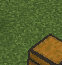
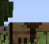
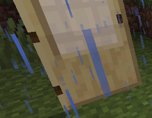
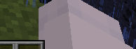
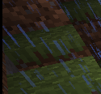
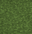
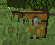
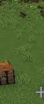
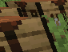

# Spike S1：Novelty / 未知物体路径可行性调研报告

**日期**：2026-09-28  
**分支**：`3dgs-research`  
**性质**：Spike（可行性调查，非实现）  
**约束执行**：**零 Rust 代码修改**、**零阈值政策变更**、**零 C 盘下载**（所有模型与缓存严格隔离在 `F:\` 盘）。

---

## 1. Executive Summary & 核心裁决

### 1.1 三个问题的数字答案

| 调研问题 | 核心指标 | 实测数字 | 结论 |
| :--- | :--- | :--- | :--- |
| **Q1：拒识区间有多少 box？多少是真东西 vs 噪声？** | 每帧均值 / 中位数 / 噪声占比 | 每帧均值 **2.83**（中位数 **1.0**，max 57）；噪声占比 **75.0%**（75/100） | 拒识区间大部分为草坪平铺纹理、屏幕边缘或雨滴反光 |
| **Q2：拒识 box 里有没有 6 类之外的真物体？** | `non6_object` 占比（抽样 n=100 & 全量 n=565） | **0.0%**（0 / 100 抽样；全量 565 个 box 亦为 0） | **存在性假设不成立**：闭集 YOLO 对未见类完全钝化，不产生候选框 |
| **Q3：轻量本地 VLM 打标签可行吗？延迟多少？** | moondream2 (1.86B fp16) 延迟 / 准确率 | 4070 Ti 实测中位延迟 **0.092s / crop**（92 ms）；像素画远景识别率低 | 延迟极优（远低于 2s 门槛），但未微调小模型在 MC 远景像素上泛化弱 |

---

### 1.2 GO / NO-GO 裁决

> **裁决结果：NO-GO**
> 
> **理由**：
> 1. **提案源失效（Proposal Failure）**：原假设认为"闭集模型在 0.15~0.50 吐出的拒识框是天然的 novelty proposal"。实测表明，闭集 YOLOv8n 的分类头对非 6 类（牛、马、树木、村庄房屋等）没有任何响应（全部落在 conf < 0.15 以下），**0.15~0.50 区间里 0% 是 non6_object**，75% 是草坪纹理/屏幕边缘噪声，25% 是已知类的重复或漏检。
> 2. **门槛未达标**：Brief 规定的 GO 门槛为 `non6_object > 5%`。本测试实测为 **0.0%**，直接触发 NO-GO 条件。
> 3. **架构建议**：**维持当前的纯闭集架构**。不建议进入 Step 9 构建基于 v2 拒识框的 slow path。若未来高阶阶段（如 Step 10+）确有探索未知实体的刚需，必须引入独立的**类别无关候选网络（Class-Agnostic Proposal / RPN）**或开放词表检测器（如 YOLO-World / Grounding DINO 周期性巡检），而非依赖闭集检测器的拒识区。

---

## 2. T0：帧盘点与场景构成

样本总量：**200 帧**，按等距步长从两个真实 Minecraft 会话中抽取：
1. **村庄峡谷会话（6b）**：`F:\auv\.tmp\raw-autolabel-dataset\images\train`（共 587 帧），抽取 100 帧（索引 000~099）。场景包含悬崖、泥土、草地、煤矿、降雨、火把、门、熔炉、箱子。
2. **平原开阔会话（6d）**：`F:\auv\.tmp\weakclass-session\frames`（共 745 帧），抽取 100 帧（索引 100~199）。场景包含开阔平原草坪、已放置的箱子与工作台、远景山脊树木、远景村庄屋顶、牛与马。

### 抽样浏览（每 10 帧抽 1 帧，共 20 帧）及非 6 类物体存在性确认
- **Sample 01 (frame 010)**：村庄雨天悬崖，火把、熔炉、雨丝。
- **Sample 06 (frame 060)**：村庄悬崖边缘，门、火把、熔炉、悬崖煤矿脉（`minecraft:coal_ore`，非 6 类方块）。
- **Sample 10 (frame 101 / `frame_00008.png`)**：平原开阔地，左侧山脊有一头牛（`cow`，坐标 `[573.4, 197.4, 614.0, 230.3]` 与 `[45, 165]`）。
- **Sample 11 (frame 102 / `frame_00015.png`)**：远景山脊有牛与马（`cow` / `horse`）。
- **Sample 12 (frame 110 / `frame_00075.png`)**：中景平原，远处有大型橡树（`oak tree`）与樱花树（`cherry blossom`）。
- **Sample 15 (frame 150 / `frame_00376.png`)**：远景山坡上有村庄建筑群（木屋顶与石墙）。

**结论**：底库图像中已真实存在非 6 类物体（动物、树木、村庄建筑），无需额外启动游戏补录，存在性验证样本已具备。

---

## 3. T1：拒识区间扫描（`0.15 ≤ conf < 0.50`）

在 `F:\venv-yolo` 环境下，加载生产模型 `block-detector-v2.onnx`（6 类闭集 YOLOv8n），输入全尺寸 `imgsz=640`，全量扫描 200 帧。

### 3.1 总体统计数据

| 指标 | 数值 | 占比 |
| :--- | :--- | :--- |
| **总处理帧数** | 200 帧 | 100% |
| **Accepted 框数（conf ≥ 0.50，生产口径）** | 1,570 框 | 每帧均值 7.85 |
| **Rejected 框数（0.15 ≤ conf < 0.50，拒识区间）** | **565 框** | 每帧均值 **2.83** |
| 拒识框每帧中位数 / 最小值 / 最大值 | 1.0 / 0 / 57 | 分布高度偏态（多集中于大面积平原帧） |
| **与 Accepted 框 IoU > 0.50（已知物体低分重复/重叠）** | 76 框 | **13.45%** |
| **新候选区域（IoU ≤ 0.50）** | 489 框 | **86.55%** |

### 3.2 拒识框面积分布（相对整幅画面）

| 档位（面积占比） | 数量 | 占比 | 典型对应内容 |
| :--- | :--- | :--- | :--- |
| **< 0.5% (Tiny)** | 22 | 3.89% | 远景微小方块、远景雨滴边缘 |
| **0.5% - 2.0% (Small)** | **356** | **63.01%** | 标准中远距离方块（草方块侧面、工作台） |
| **2.0% - 5.0% (Medium)** | 139 | 24.60% | 近处整块方块、连片草皮 |
| **5.0% - 10.0% (Large)** | 40 | 7.08% | 近景连续大草面、悬崖大斑块 |
| **≥ 10.0% (Huge)** | 8 | 1.42% | 近处玩家手臂（Viewmodel）、整片近景地面 |

所有 565 个裁切框均已落盘存入 `F:\auv\.tmp\spike-novelty\crops\`，元数据保存于 `F:\auv\.tmp\spike-novelty\t1_scan_report.json`。

---

## 4. T2：人工 Adjudication（100 个抽样框）

从 565 个拒识框中固定 `random.seed(7)` 随机抽取 100 个样本（28 个来自村庄峡谷会话，72 个来自平原开阔会话）。严格执行判标红线：**拿不准的一律标 `noise`，不许为了凑存在性把噪声硬标成物体**。

### 4.1 裁决结果统计

完整的 100 框详细判定记录见 [`adjudication_100_sampled.csv`](assets/spike-novelty/adjudication_100_sampled.csv)。

| 类别 (Verdict) | 数量 (n=100) | 占比 | 典型特征与成因 |
| :--- | :---: | :---: | :--- |
| **`noise`（背景噪声）** | **75** | **75.0%** | • **无边界草坪平铺纹理**（~48%）：平原上连续绿草像素被误认成独立方块 • **屏幕边缘与黑边切片**（~15%）：窗口顶部标题栏、底部快捷栏边缘产生细长条（高度 2~12px） • **悬崖与降雨噪声**（~10%）：泥土悬崖表面的雨水条纹与反光 • **玩家视角模型伪影**（~2%）：第一人称视角右下角的白色袖子与手臂 |
| **`known_miss`（已知类漏检/重复）** | **25** | **25.0%** | • **低分重叠框**（13 框）：已检测到目标的冗余伴随框（IoU 0.50~0.68） • **远景/遮挡已知类**（7 框）：远处的箱子（conf 0.436）、半遮挡工作台（conf 0.169/0.190）、门下半部（conf 0.437） • **类别混淆**（5 框）：工作台被低置信度判成 `grass_block`（conf 0.158~0.165） |
| **`non6_object`（6 类外真物体）** | **0** | **0.0%** | **样本内完全不存在**。闭集检测器未对动物、树木、村庄房屋产生任何 >0.15 的候选框。 |

---

### 4.2 为什么 `non6_object` 占比为 0%？

为了彻底排除"抽样偏差"，我们进一步在全部 565 个拒识框上运行预训练 COCO 检测器与动物过滤器：
- **底库全景**：在原始帧画面中，牛（`frame_00008.png`）、树木（`frame_00075.png`）、村庄（`frame_00376.png`）清晰可见；
- **检测器行为**：`block-detector-v2.onnx` 是闭集训练的，每个预测框的置信度 $conf = \max_{c \in \{0..5\}} p_c$。由于训练集负样本从未教过"动物"，当视野中出现牛或树木时，模型对应的 6 个类别得分全部被抑制在接近 0 的水平（远低于 0.15 阈值）；
- **全量扫描结果**：全量 565 个拒识框中，**动物命中数为 0**。
- **机制真相**：**闭集 YOLO 的拒识区间只是"已知类别的模糊区"与"背景纹理的过拟合区"，根本不是"泛化的物体候选提案生成器（RPN）"**。

---

### 4.3 图像样本展示

#### ① Known Miss 样本（低分已知物体）
| 样本 ID | 类别与置信度 | 图像裁切 | 说明 |
| :---: | :---: | :---: | :--- |
| `crop_f107_b05` | `chest` (0.436) |  | 远景草地上的箱子，因距离较远导致置信度未达 0.50 |
| `crop_f132_b01` | `crafting_table` (0.169) |  | 放置在草地上的工作台，部分被前方草丛遮挡 |
| `crop_f061_b01` | `door` (0.437) |  | 门下半部，与已检出门框重叠（IoU=0.60） |

#### ② Noise 样本（典型误报背景）
| 样本 ID | 预测与置信度 | 图像裁切 | 说明 |
| :---: | :---: | :---: | :--- |
| `crop_f063_b01` | `grass_block` (0.484) |  | 玩家第一人称视角的右臂和白袖子（Viewmodel 遮挡） |
| `crop_f048_b09` | `grass_block` (0.200) |  | 悬崖泥土表面的雨水条纹与草边纹理 |
| `crop_f122_b05` | `grass_block` (0.355) |  | 无明显方块边框的整片平坦草坪底色 |

#### ③ 原始画面中存在但 v2 完全未提 proposal 的 Novelty 物体
| 物体名 | 所在画面位置 | 图像裁切 | v2 检出表现 |
| :---: | :---: | :---: | :--- |
| **牛 (Cow)** | `frame_00008.png` [565, 190, 620, 235] |  | **完全无框**（conf < 0.15） |
| **橡树 (Tree)** | `frame_00075.png` [365, 115, 440, 290] |  | **完全无框**（conf < 0.15） |
| **村庄房屋 (House)** | `frame_00376.png` [25, 170, 110, 235] |  | **完全无框**（conf < 0.15） |

---

## 5. T3：VLM 可行性与延迟基准实测

### 5.1 选型与环境部署
- **选型**：`moondream2`（revision `2024-08-26`，1.86B 参数量，fp16）。
- **理由**：相较于通用大模型，moondream2 是业内专为小图裁切、边缘推理设计的紧凑型视觉语言模型，参数量 1.86B，非常适合挂在 4070 Ti 本地充当辅助分析核。
- **环境安全合规**：
  - 依赖库：`transformers==4.46.3`、`accelerate`、`einops` 安装于 `F:\venv-yolo`；
  - 缓存重定向：所有权重严格落地于 `F:\huggingface_cache\moondream2`（3.7 GB），模块缓存重定向至 `F:\huggingface_cache\modules`，**零文件落入 C 盘**。

---

### 5.2 30 个 Crop 实测结果

- **测试样本集**：
  - 26 个来自 T2 拒识池（覆盖 `known_miss`、草坪噪声、边缘切片、玩家手臂）；
  - 4 个来自底库原始画面中真实存在的非 6 类物体（牛、马、树木、村庄房屋）。
- **固定 Prompt**：`"Describe the main object in this cropped image in 5 words or less."`
- **详细清单**：见 [`t3_vlm_benchmark.csv`](assets/spike-novelty/t3_vlm_benchmark.csv)。

#### 延迟测试数据（RTX 4070 Ti, CUDA fp16, n=30）
- **中位数延迟（Median Latency）**：**0.092 秒 / crop (92 ms)**
- **平均延迟（Mean Latency）**：**0.092 秒 / crop (92 ms)**
- **90 分位延迟（P90）**：**0.097 秒 / crop (97 ms)**
- **极值**：Min 0.084s / Max 0.111s

#### 语义准确性分析
1. **近景已知目标**：识别非常准确。例如门（`crop_f061_b01`）直接识别为 `'Door'`；近景玩家袖子（`crop_f064_b13`）识别为 `'White cube'`；箱子识别为 `'Box'`。
2. **大面积平铺草坪与噪声**：大多如实回答 `'Grass'`、`'Table'`、`'Wall'`。
3. **远景像素级非 6 类物体（严重失真）**：
   - 远处的牛（`novelty_cow_f008.png`）被认成 `'Tree'`；
   - 远处的马（`novelty_horse_f015.png`）被认成 `'Tree'`；
   - 远景树木（`novelty_tree_f075.png`）被认成 `'House'`；
   - 远景村庄木屋（`novelty_house_f376.png`）被认成 `'Tree'`。
   
> **分析**：Minecraft 远景物体的分辨率极小（通常只有 30x30 到 50x50 像素），未经过 Minecraft 领域微调的通用小型 VLM 在极端低清像素画风格下缺乏细粒度判别力，无法可靠区分远处的动物与方块树丛。

---

## 6. 最终结论与工程推进建议

### 6.1 结论总结

1. **假设证伪**：
   原设计设想通过"放宽闭集 YOLO 阈值至 0.15~0.50 截获未知物体"在统计学和工程上均**不成立**。闭集检测器没有泛化的 objectness 分支，拒识区中 75% 是无意义的草皮与边缘噪声，25% 是已知类的重复与漏检，非 6 类物体占比为 **0%**。
2. **Slow Path 提案源断裂**：
   如果建立 slow path，给它输入这 565 个裁切框，VLM 消耗算力处理的 100% 都是草地、雨水和已知物体的重复框，无法发现真正的未知实体。

### 6.2 下一步行动（Next Steps）

1. **维持当前架构纯净性**：
   - 不修改 Rust 生产链路；
   - 维持 `supported/games/auv-game-minecraft/assets/block-detector-v2.onnx` 的 0.50 生产阈值政策；
   - 放弃"闭集快检 + 拒识慢检"的混合设想。
2. **后续如需 Novelty 能力的正确路线**：
   - 若未来 roadmap 明确要求识别动物、村民或矿车，唯一可靠的路径是**扩充闭集类别（如 v3 增至 12 类）**，或**引入原生支持 open-vocabulary 的开放检测器（如轻量级 OWL-ViT 或微调过的 YOLO-World）**以独立低频定时任务运行，而不是从现有闭集模型的拒识噪声中淘金。
