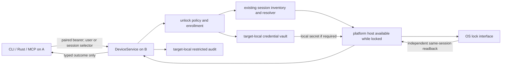

# Remote Device unlock: existing locked sessions first

Status: owner-approved scope revision on 2026-09-28; implementation design, not a support claim. The first native Device release targets an **already logged-in OS session that was subsequently locked** on macOS, Debian GNOME, and Windows. An already usable selected session returns a no-op result. A user with no current session is not signed in by this release. Ordinary greeter sign-in requires a separate implementation slice and platform proof. FileVault/LUKS preboot remains outside the Device API.

The typed Device gRPC, Rust facade, CLI, MCP, and gRPC-only JS session contract use `ListUserSessions`, `GetUserSession`, and `EnsureUserSessionUnlocked`. The macOS daemon connects these methods to target-local policy and the signed graphical host; [the spare-Mac gate](2026-09-28-macos-locked-session-host-gate.md) records two successful black-display unlocks through `DeviceService` on an owner-verified Unix socket. The [Linux final gate](2026-09-28-linux-gnome-locked-session-host-handoff.md#2026-09-29-final-review-fix-retest) passed Mac-originated paired gRPC unlock for both `PENDING` and `READY` enrollment, each with target-local PAM revalidation, same-session readback, audit, and owner confirmation. The monitor did not wake automatically on the second attempt. The [Windows installed candidate gate](2026-09-28-windows-locked-session-host-handoff.md) passed one Mac-originated paired unlock of the same physical-console login, with WTS, audit, and owner-visible confirmation. Ordinary foreground Windows `auv serve` retains `UNSUPPORTED_OS_STATE`; release packaging and broader configuration gates remain open. The wire enum already contains `SIGNED_IN_NEW_SESSION`; it is **reserved and rejected as a first-release effect**. These results are configuration-specific live evidence, not a general production support claim.

## Evidence and scope

The [live research record](2026-09-27-remote-device-unlock-research.md) and Codex session `01a0e1d4-a4e9-7f62-bb45-ad37346119f8` contain three **throwaway native proofs**, each for one existing locked session:

| Target | Observed unlock | What remains unproved |
| --- | --- | --- |
| `neko-mbp-m1`, macOS 26.3 | An authorized graphical helper received a remote non-secret trigger, used a credential entered locally before lock, reported `unlock_observed=true`, and the owner saw the desktop return. | Installed AUV host, persistent secret retrieval while locked, and other Mac configurations. The later signed-out `LoginWindow` digit gates failed. |
| `neko-gpu-1`, Debian 13 GNOME Wayland | SSH-triggered `loginctl unlock-session 52` changed both logind `LockedHint` and GNOME `GetActive` from locked to unlocked on the same session. | Installed daemon identity/policy and other desktop or display-manager combinations. This route did not need a password on that host. |
| `luoling-windows-11`, Windows 11 Pro | A one-shot SYSTEM worker entered the locally held alphanumeric PIN on the selected console session's `Winlogon` desktop; WTS and the owner confirmed unlock. | Installed privileged host, persistent secret retrieval, other credential providers, and other session arrangements. |

These probes did not exercise the AUV Device API. Compilation and native input acceptance are not unlock claims; each shipped platform path needs independent post-action state readback. The macOS [signed-out gate](2026-09-27-remote-device-unlock-research.md#macos-263-signed-out-feasibility-gate-2026-09-28) and [remote-desktop comparison](2026-09-28-macos-remote-desktop-loginwindow-research.md) are retained as future-path evidence, not a prerequisite for the locked-session release.

## First-release behavior

An authenticated paired Device A requests that target B unlock one selected, existing OS login session. B authenticates the bearer, checks its target-local switch and account enrollment, resolves the current session, and invokes the platform host. B observes the intended session's post-action state independently and returns a typed result. The credential, where needed, is enrolled and retrieved **on B**; the remote request, response, Run, trace, artifact, command argument, and environment variable never carry it. The [authority decision](2026-09-27-device-unlock-authority-decision.md), [credential decision](2026-09-27-device-entry-credential-decision.md), and [terms](../../../TERMS_AND_CONCEPTS.md) retain their shared policy where applicable; their signed-out portions are deferred by this revision.

| Selected state | First-release result |
| --- | --- |
| Exactly one eligible existing session, locked | Attempt native unlock and return `UNLOCKED_EXISTING_SESSION` only after independent verification. |
| Exactly one eligible existing session, already usable | Return `ALREADY_USABLE` without secret lookup, input, or focus change. |
| User has no existing session | Fail without opening a greeter, retrieving a credential, or creating a session. The landed wire can report `UNSUPPORTED_OS_STATE`; the contract-alignment slice decides whether a more precise no-session error is needed. |
| Multiple sessions match a user | Return ambiguity; require an explicit current session selector. |
| Supplied selector is stale or its resolved session owner no longer matches the enrolled OS identity | Fail before secret retrieval. |

The `EnsureUserSessionUnlockedRequest` oneof selects `user` or `session_selector`. `ListUserSessions` supplies opaque selectors plus OS user and lock facts; `GetUserSession` resolves one selector. Lock state is `LOCKED`, `USABLE`, or explicitly `UNKNOWN` when OS observation cannot decide; protobuf `UNSPECIFIED` is an invalid response. These are Device operations, not an AUV `SessionService`. Revalidate the selector and stable OS account identity before native delivery. `auv --device B devices unlock --user neko` and `--session <selector>` share the Rust facade and gRPC path; CLI and MCP must not duplicate unlock policy. The remote caller cannot enroll accounts, select plaintext storage, change the switch, or read audit history.

An active paired bearer may request unlock without a separate per-bearer grant. The target-wide switch starts enabled and can be disabled only by a target-local OS administrator; disabling also rejects remote session listing. A selected OS account still needs local enrollment with a usable credential under the accepted policy, including GNOME where the observed unlock method did not consume it. This eligibility rule must not cause the Linux adapter to submit an unnecessary password. Enrollment and deletion authenticate the real local OS UID/SID; `CallerId::local_owner()` and a requested username are insufficient proof of account ownership. An administrator may manage any account; an ordinary user may manage only their own.

## Runtime boundary

The serving process and platform host must remain reachable **while a user is logged in and locked**. This first release does not require survival after all graphical users log out. Windows still needs an installed privileged component to place a worker in the selected session; macOS needs an authorized graphical helper; Linux needs a caller identity permitted to request the selected session's unlock. A machine-level, boot-started daemon that survives logout remains a future host-lifecycle design, not a gate for this release. The host exposes inventory, one attempt on a validated session, and effect readback; it must not create a new user session in this phase.

The target-local management gRPC contract is `DeviceLocalService` in `device_local.proto`. It is served on a dedicated Unix socket on macOS and Linux, separate from the paired-device listener and HTTP gateway. Enrollment, enrollment inspection/deletion, audit reads, and the target-wide switch belong to this service; session listing and unlock remain on `DeviceService`. The local CLI accepts a credential through hidden target-local terminal input and sends it only over that socket. The service identifies the actual peer OS UID, not a username in the request or `CallerId::local_owner()`. Windows has a service-mode-only named-pipe candidate that verifies client SID and limits Authenticated Users to data read/write rights. Its client requests exact rights and verifies the connected server's LocalSystem token in Session 0 before opening a gRPC channel. The Windows CLI reads a PIN only from an attached local console. Native unit tests and one installed target-local connection, enrollment, removal, and paired unlock gate passed on the tested host. See the [Windows handoff](2026-09-28-windows-locked-session-host-handoff.md).

The Unix socket has a short, deterministic path under a `0700` daemon-owned directory in the system temporary root. Its name derives from the canonical store-root path and the daemon's effective UID, so a deep project path does not exceed the Unix socket address limit. The daemon atomically creates and checks that directory; the CLI derives its own effective-UID path and checks the directory's owner and mode before connecting. A same-UID Linux daemon and CLI can serve that user's enrollment, while a root-owned macOS daemon requires a root-run local CLI. Cross-UID root administration of a user daemon is deferred until an explicit target-UID selection and server-identity gate exists. The broader ordinary-user self-enrollment rule on a root-owned multi-account host remains a separate implementation gap: it needs a reachable socket parent without exposing private metadata and a reviewed per-user helper authorization path. No multi-account support claim follows from the current local listener.

The enrollment RPCs are `Enroll`, `GetEnrollment`, `ListEnrollments`, and `RemoveEnrollment`. `Enroll` updates one OS account's target-local enrollment and returns a status response; the two read RPCs return only non-secret metadata. `RemoveEnrollment` revokes that account's eligibility. The local service also defines `GetPolicy`, `SetPolicy`, and `ListAudit`; `SetPolicy` requires the authenticated target-local OS administrator, while audit reads filter by that real OS principal. The dedicated Unix listener is implemented on macOS and Linux; release installation and other host configurations remain open, while one GNOME locked-host gate passed. Windows has a gated LocalSystem backend, protected PIN vault, restricted metadata/audit/pairing store, named-pipe client/server, and console CLI candidate. Its installed client/server and locked-session Device API gates passed on one owner-observed host; elevated Windows administrator-group authorization and release installation remain incomplete. The existing [credential decision](2026-09-27-device-entry-credential-decision.md) requires a stored credential even on GNOME, so `Enroll` does not include a credential-free logind-policy mode. A change to that product rule must update the credential and authority decisions before such a mode is implemented.

Enrollment remains `PENDING` after storage until retrieval succeeds under the **actual unlock host identity while locked**; only then can it become `READY` and eligible for remote unlock. A first remote unlock request may perform this target-local retrieval check and promote a pending enrollment before native delivery, but it must fail without input if retrieval or session identity cannot be verified. A protected OS store is preferred; only a target-local administrator may explicitly choose the accepted plaintext-file fallback. No automatic fallback or remote selection is allowed. Persist stable OS account identity beside a vault reference. Deletion blocks later requests; a confirmed credential rejection suspends the account until local re-enrollment. An input-delivery failure or unverified outcome alone is not a rejection.

## Platform implementation and gates

| Platform | First-release route and gate | Explicit limit |
| --- | --- | --- |
| macOS | Package a signed, Accessibility-authorized graphical helper in the logged-in user's context. Verify target-local secret retrieval under its installed identity, a remote trigger while locked, actual credential entry, and both system lock-state readback and owner observation. The throwaway HID probe is evidence for this specific state, not an installed-service proof. | A system LaunchDaemon cannot assume GUI access ([Apple daemon guidance](https://developer.apple.com/library/archive/documentation/MacOSX/Conceptual/BPSystemStartup/Chapters/DesigningDaemons.html)). Signed-out `LoginWindow` and FileVault paths stay unsupported. |
| Debian GNOME Wayland | Resolve the physical GNOME session, call logind's unlock method under the installed host's real identity, and read back **the same session's** `LockedHint`. Verify denial and ambiguity, then confirm the visible desktop in the supervised installed gate. GNOME ScreenSaver `GetActive` reports a separate shield state and cannot be required to match the lock hint. | This is a candidate GNOME/logind policy on one host, not generic Linux or GDM support ([systemd loginctl](https://www.freedesktop.org/software/systemd/man/252/loginctl.html), [GNOME screen shield](https://github.com/GNOME/gnome-shell/blob/48.7/js/ui/screenShield.js)). |
| Windows 11 | Install a controlled privileged host. In the selected locked console session, bind a fresh worker thread to the current input desktop, send Return if needed, then bind another fresh thread to `Winlogon` for the locally retrieved PIN. Verify the same WTS session becomes unlocked and the intended user remains selected. | Session 0 cannot directly interact with the console ([Microsoft services](https://learn.microsoft.com/en-us/windows/win32/services/service-changes-for-windows-vista)); desktop binding has thread preconditions ([Microsoft API](https://learn.microsoft.com/en-us/windows/win32/api/winuser/nf-winuser-setthreaddesktop)). The proof covered one alphanumeric PIN, not every sign-in provider. |

Each platform adapter is enabled only after its own installed-path gate passes. An unsupported desktop, greeter, session arrangement, unavailable host, or unverified outcome returns an explicit error. Generic `InputActionResult` can describe delivery, but only OS state readback establishes `UNLOCKED_EXISTING_SESSION`.

## Audit, trace, and concurrency

B writes a durable target-local audit attempt and terminal outcome with authenticated paired Device ID, selected OS account/session, time, and typed result. A local OS administrator may read all records; an ordinary local user may read only records concerning their own account. The remote caller receives only the current result. Do not store audit as an ordinary caller-owned Run readable by that paired bearer. Use an allowlist of fields and restricted permissions; credential bytes, secret-bearing driver requests, key values, password-field screenshots, and secret-derived error strings are excluded from Run, trace, audit, telemetry, and artifacts.

The host checks switch, pairing, enrollment generation, account identity, and session state at admission and again before native delivery. Serialize requests per account. A completed deletion blocks subsequent requests; input already sent to the OS cannot be recalled. Loss of audit write capability before delivery rejects the attempt. A terminal write failure after an OS action must appear in the result. The macOS policy now writes a fixed `CANCELED` terminal audit record when a queued request is dropped while waiting for the policy or account lock; tests cover both waits. Storage retention remains a separate audit decision.

For a queued paired request, the daemon carries the authenticated bearer's SHA-256 digest only in private in-memory caller context. It rechecks that exact credential against the live pairing snapshot after the account wait. On Linux, protected credential retrieval can await; the host therefore checks the bearer again immediately before invoking the installed `gdm-password` PAM stack. That PAM stack may act on GNOME Keyring, so this check admits its effects. A second check after PAM admits logind `Unlock`; revocation before that check blocks the OS unlock but cannot reverse an already admitted PAM effect. Revocation after the second check affects later attempts, while already admitted native input may complete. A newly paired Device reusing the same ID cannot revive the old request. The digest is absent from caller Debug, Run identity, audit, response, and generated SDK values. Owner-verified local Unix requests retain their separate local authority.

## Progressive implementation plan

1. **Align the landed contract with locked-session scope.** Use `ListUserSessions`, `GetUserSession`, and `EnsureUserSessionUnlocked` as the typed path. Specify no-existing-session behavior; mark `SIGNED_IN_NEW_SESSION` reserved for this phase and ensure no adapter emits it. Narrow facade, CLI, and MCP descriptions that currently promise signed-out sign-in. Test ambiguity, stale selector, disabled, unenrolled, suspended, already usable, and no existing session through public behavior.
2. **Implement local authority, enrollment, and reachable hosts.** Authenticate a real local OS principal for enrollment/deletion and switch management. Store and retrieve a persistent target-local credential under the installed unlock host's identity; keep plaintext fallback explicit and administrator-only. Install only the lifecycle each platform needs to remain reachable while an existing user session is locked. Test restart/lock availability, account deletion, and permission boundaries.
3. **Integrate the three native locked-session routes.** Repeat the prior Mac, GNOME, and Windows proofs through the actual Device API and installed host. Require the same selected session to become usable, with independent OS readback and an owner-visible check during the first live gate. Gate claims per OS/configuration; one passing platform does not imply the others.
4. **Finish restricted audit and release validation.** Test paired-caller authorization, local-only audit reads, secret exclusion from Run/trace/artifacts, one confirmed-rejection suspension, and one delivery-without-unlock result. Run focused contract and platform tests and document the actual supported configurations.

**Deferred signed-out work.** Ordinary greeter sign-in, fast-user-switch admission, machine-level lifetime across logout, pre-login credential availability, and the `SIGNED_IN_NEW_SESSION` effect require a separate owner-approved plan and successful platform gates. The earlier [host-lifecycle decision](2026-09-27-device-login-host-lifecycle-decision.md) and [macOS comparison](2026-09-28-macos-remote-desktop-loginwindow-research.md) preserve that future design. No signed-out capability may be inferred from a locked-session release.
