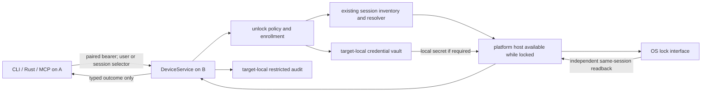

# Remote Device unlock: existing locked sessions first

Status: owner-approved implementation design as of 2026-09-28, not a support
claim. The first native Device release targets an **already logged-in OS
session that was subsequently locked** on macOS, Debian GNOME, and Windows. An
already usable selected session returns a no-op result. A user with no current
session is not signed in by this release. Ordinary greeter sign-in requires a
separate owner-approved implementation slice and platform proof. FileVault and
LUKS preboot remain outside the Device API.

## Evidence and scope

The [live research record](2026-09-27-remote-device-unlock-research.md) contains
three throwaway native proofs, one for an existing locked session on each target
platform. The [macOS](2026-09-28-macos-locked-session-host-gate.md),
[Linux](2026-09-28-linux-gnome-locked-session-host-handoff.md), and
[Windows](2026-09-28-windows-locked-session-host-handoff.md) records preserve
later candidate evidence separately from this contract. Compilation and native
input acceptance are not unlock claims; each platform path needs independent
post-action state readback. These records do not establish general platform
support.

## First-release behavior

An authenticated paired Device A requests that target B unlock one selected,
existing OS login session. B authenticates the bearer, checks its target-local
switch and account enrollment, resolves the current session, and invokes the
platform host. B must observe the intended session's post-action state
independently before returning a typed success. The credential, where needed,
is enrolled and retrieved on B; the remote request, response, Run, trace,
artifact, command argument, and environment variable must never carry it.

| Selected state | Required first-release result |
| --- | --- |
| Exactly one eligible existing session, locked | Attempt native unlock and return `UNLOCKED_EXISTING_SESSION` only after independent verification. |
| Exactly one eligible existing session, already usable | Return `ALREADY_USABLE` without secret lookup, input, or focus change. |
| User has no existing session | Fail without opening a greeter, retrieving a credential, or creating a session. The implementation slice must decide whether `UNSUPPORTED_OS_STATE` is sufficiently precise. |
| Multiple sessions match a user | Return ambiguity and require an explicit session selector. |
| Selector is stale or resolves to another account | Fail before secret retrieval. |

The proposed `DeviceService` contract adds `ListUserSessions`,
`GetUserSession`, and `EnsureUserSessionUnlocked`. The unlock request selects
either `user` or `session_selector`. Listing supplies opaque selectors plus OS
user and lock facts; lookup resolves one selector. Lock state is `LOCKED`,
`USABLE`, or explicitly `UNKNOWN`; protobuf `UNSPECIFIED` is not a valid
response. These are Device operations, not an AUV `SessionService`. The wire
may reserve `SIGNED_IN_NEW_SESSION`, but no first-release adapter may emit it.

`auv --device B devices unlock --user neko` and `--session <selector>` must
share the Rust facade and gRPC path; CLI and MCP must not duplicate unlock
policy. The remote caller cannot enroll accounts, select credential storage,
change the target-wide switch, or read audit history.

An active paired bearer may request unlock without a separate per-bearer grant.
The target-wide switch starts enabled and can be disabled only by a target-local
OS administrator; disabling also rejects remote session listing. A selected OS
account still needs local enrollment with a usable credential, including on a
GNOME configuration where the observed unlock method did not consume it.
Enrollment and deletion must authenticate the real local OS UID or SID rather
than trusting `CallerId::local_owner()` or a requested username.

## Runtime boundary

The serving process and platform host must remain reachable while a user is
logged in and locked. This release does not require survival after all
graphical users log out. Windows needs a privileged component able to place a
worker in the selected session; macOS needs an authorized graphical helper;
Linux needs an identity permitted to request the selected session's unlock.
The host exposes inventory, one attempt on a validated session, and effect
readback. It must not create a new user session in this phase.

Target-local credential management belongs to a dedicated, OS-authenticated
`DeviceLocalService`, separate from paired routes. It owns `Enroll`,
`GetEnrollment`, `ListEnrollments`, `RemoveEnrollment`, `GetPolicy`,
`SetPolicy`, and `ListAudit`. The local CLI must accept a credential through
hidden target-local input and send it only over the authenticated local IPC
endpoint. Cross-UID administration needs an explicit, reviewed authorization
path; no multi-account support claim follows from a same-UID listener.

Enrollment remains `PENDING` after storage until retrieval succeeds under the
actual unlock host identity while locked. Only then may it become `READY` and
eligible for remote unlock. This implementation slice supports protected
credential stores only and must reject a plaintext choice explicitly. The
broader accepted policy permits a future administrator-selected plaintext
fallback, but it requires a separate implementation decision; there is no
automatic fallback and a paired caller can never select one. Persist stable OS
account identity beside the vault reference. Confirmed credential rejection
suspends the enrollment until local re-enrollment; an input-delivery failure or
unverified outcome alone is not a rejection.

## Platform gates

- **macOS:** require an installed, signed, Accessibility-authorized graphical
  helper, locked retrieval under its installed identity, same-session readback,
  and owner observation. Signed-out `LoginWindow` remains unsupported.
- **Debian GNOME Wayland:** resolve the physical GNOME session, call logind
  under the installed identity, revalidate the credential through the selected
  PAM policy, and read back the same session's `LockedHint`. This does not imply
  generic Linux or GDM support.
- **Windows 11:** use a controlled privileged host and selected-session worker,
  then verify the same WTS login becomes usable. One credential provider or
  console arrangement does not imply general Windows support.

Each platform adapter is enabled only after its own installed-path gate passes.
An unsupported desktop, greeter, session arrangement, unavailable host, or
unverified outcome returns an explicit error. `InputActionResult` can describe
delivery, but only OS state readback establishes `UNLOCKED_EXISTING_SESSION`.

## Audit and concurrency

The target writes a durable local audit attempt and terminal outcome with the
authenticated paired Device ID, selected account or session, time, and typed
result. A local administrator may read all records; an ordinary user may read
only records for their own account. Credentials, secret-bearing input, native
secret-derived errors, and login-field screenshots are excluded from Run,
trace, audit, telemetry, and artifacts.

The host rechecks the switch, pairing, enrollment generation, account identity,
and session state before native delivery. Requests serialize per account. A
completed deletion blocks later requests; input already sent cannot be recalled.
Loss of audit write capability before delivery rejects the attempt. Pairing
revocation must be rechecked after waits and before effects that cannot be
reversed.

## Implementation order

1. Add and test the typed Device and local-management contracts, including
   ambiguity, stale selectors, disabled policy, enrollment states, already
   usable sessions, and no existing session.
2. Implement authenticated local enrollment, protected credential retrieval,
   restricted audit, and a host reachable while the session is locked.
3. Integrate and gate the three native locked-session routes independently.
4. Validate paired authorization, revocation during waits, secret exclusion,
   confirmed-rejection suspension, and delivery-without-unlock outcomes.

**Deferred signed-out work.** Greeter sign-in, fast-user switching, lifetime
across logout, pre-login credential availability, and a
`SIGNED_IN_NEW_SESSION` effect require a separate owner-approved plan and
successful platform gates. The earlier [host-lifecycle
decision](2026-09-27-device-login-host-lifecycle-decision.md) and [macOS
comparison](2026-09-28-macos-remote-desktop-loginwindow-research.md) preserve
that future design. No signed-out capability may be inferred from this scope.
